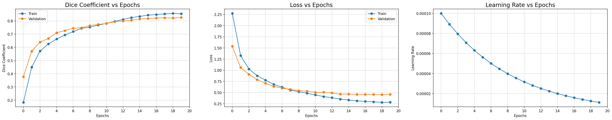

<p>
  <a href="https://colab.research.google.com/drive/1J-PQgIJWOCb7hoc4eiOCna1gUf0cnMCW">
    
  </a>

  <a href="https://mybinder.org/v2/gh/ayushdabra/drone-images-semantic-segmentation/HEAD">
    
  </a>
</p>

# Multiclass Semantic Segmentation of Aerial Drone Images Using Deep Learning.

## Abstract:

<p align="justify">
Semantic segmentation is the task of clustering parts of an image together which belong to the same object class. It is a form of pixel-level prediction because each pixel in an image is classified according to a category. In this project, semantic segmentation is performed on <a href="http://dronedataset.icg.tugraz.at/">Semantic Drone Dataset</a> by using transfer learning on a VGG-16 backbone (trained on ImageNet) based UNet CNN model. The implementation uses PyTorch 2.5, providing cross-platform compatibility for Windows 11 and Linux with Python 3.11. Data augmentation is applied to the training set to artificially increase the amount of data and avoid overfitting. The model achieves strong performance with approximately 87% dice coefficient on the validation set.</p>

**Framework:** PyTorch 2.5  
**Python Version:** 3.11  
**Platform Support:** Windows 11, Linux

The Jupyter Notebook can be accessed from <a href="./semantic-drone-dataset-vgg16-unet.ipynb">here</a>.

## What is Semantic Segmentation?:

<p align="justify">
Semantic segmentation is the task of classifying each and very pixel in an image into a class as shown in the image below. Here we can see that all persons are red, the road is purple, the vehicles are blue, street signs are yellow etc.</p>

<p align="center">

</p>

<p align="justify">
Semantic segmentation is different from instance segmentation which is that different objects of the same class will have different labels as in person1, person2 and hence different colours.</p>

<p align="center">

</p>

## Semantic Drone Dataset:

<p align="justify">The <a href="http://dronedataset.icg.tugraz.at/">Semantic Drone Dataset</a> focuses on semantic understanding of urban scenes for increasing the safety of autonomous drone flight and landing procedures. The imagery depicts more than 20 houses from nadir (bird's eye) view acquired at an altitude of 5 to 30 meters above ground. A high resolution camera was used to acquire images at a size of 6000x4000px (24Mpx). The training set contains 400 publicly available images and the test set is made up of 200 private images.</p>

<p align="center">
  
</p>

<br>

### Semantic Annotation:

The images are labeled densely using polygons and contain the following 24 classes:

| Name        | R   | G   | B   | Color                                                                                                |
| ----------- | --- | --- | --- | ---------------------------------------------------------------------------------------------------- |
| unlabeled   | 0   | 0   | 0   | <p align="center"></p>   |
| paved-area  | 128 | 64  | 128 | <p align="center"></p>  |
| dirt        | 130 | 76  | 0   | <p align="center"></p>        |
| grass       | 0   | 102 | 0   | <p align="center"></p>       |
| gravel      | 112 | 103 | 87  | <p align="center"></p>      |
| water       | 28  | 42  | 168 | <p align="center"></p>       |
| rocks       | 48  | 41  | 30  | <p align="center"></p>       |
| pool        | 0   | 50  | 89  | <p align="center"></p>        |
| vegetation  | 107 | 142 | 35  | <p align="center"></p>  |
| roof        | 70  | 70  | 70  | <p align="center"></p>        |
| wall        | 102 | 102 | 156 | <p align="center"></p>        |
| window      | 254 | 228 | 12  | <p align="center"></p>      |
| door        | 254 | 148 | 12  | <p align="center"></p>        |
| fence       | 190 | 153 | 153 | <p align="center"></p>       |
| fence-pole  | 153 | 153 | 153 | <p align="center"></p>  |
| person      | 255 | 22  | 0   | <p align="center"></p>      |
| dog         | 102 | 51  | 0   | <p align="center"></p>         |
| car         | 9   | 143 | 150 | <p align="center"></p>         |
| bicycle     | 119 | 11  | 32  | <p align="center"></p>     |
| tree        | 51  | 51  | 0   | <p align="center"></p>        |
| bald-tree   | 190 | 250 | 190 | <p align="center"></p>   |
| ar-marker   | 112 | 150 | 146 | <p align="center"></p>   |
| obstacle    | 2   | 135 | 115 | <p align="center"></p>    |
| conflicting | 255 | 0   | 0   | <p align="center"></p> |

### Sample Images:

<p align="center"></p>
<p align="center"></p>
<p align="center"></p>
<p align="center"></p>

## Technical Approach:

### Data Augmentation using Albumentations Library:

<p align="justify"><a href="https://albumentations.ai/">Albumentations</a> is a Python library for fast and flexible image augmentations. Albumentations efficiently implements a rich variety of image transform operations that are optimized for performance, and does so while providing a concise, yet powerful image augmentation interface for different computer vision tasks, including object classification, segmentation, and detection.</p>

<p align="justify">The dataset contains 400 images, which are split into 320 images (80%) for training and 80 images (20%) for validation. To artificially increase the amount of training data and avoid overfitting, data augmentation is applied. The augmentation techniques increase the training data by 5 times, resulting in 1600 training images and 80 validation images.</p>

Data augmentation is achieved through the following techniques:

- Random Cropping.
- Horizontal Flipping.
- Vertical Flipping.
- Rotation.
- Random Brightness and Contrast.
- Contrast Limited Adaptive Histogram Equalization (CLAHE).
- Grid Distortion.
- Optical Distortion.

Here are some sample augmented images and masks of the dataset:

<p align="center"></p>
<p align="center"></p>

<br>

<p align="center"></p>
<p align="center"></p>

<br>

<p align="center"></p>
<p align="center"></p>

<br>

<p align="center"></p>
<p align="center"></p>

### VGG-16 Encoder based UNet Model:

<p align="justify">The <a href="https://arxiv.org/abs/1505.04597">UNet</a> was developed by Olaf Ronneberger et al. for Bio Medical Image Segmentation. The architecture contains two paths. First path is the contraction path (also called as the encoder) which is used to capture the context in the image. The encoder is just a traditional stack of convolutional and max pooling layers. The second path is the symmetric expanding path (also called as the decoder) which is used to enable precise localization using transposed convolutions. Thus, it is an end-to-end fully convolutional network (FCN), i.e. it only contains Convolutional layers and does not contain any Dense layer because of which it can accept image of any size.</p>

In the original paper, the UNet is described as follows:

<p align="center">

</p>

<p align="center"><i>U-Net architecture (example for 32x32 pixels in the lowest resolution). Each blue box corresponds to a multi-channel feature map. The number of channels is denoted on top of the box. The x-y-size is provided at the lower left edge of the box. White boxes represent copied feature maps. The arrows denote the different operations.</i></p>

#### Custom VGG16-UNet Architecture:

- VGG16 model pre-trained on the ImageNet dataset has been used as an Encoder network (using PyTorch's torchvision.models.vgg16).

- A Decoder network has been extended from the last layer of the pre-trained model, and it is concatenated to the consecutive convolution blocks.

- The implementation uses PyTorch 2.5 with full support for both GPU (CUDA) and CPU execution.

<p align="center">

</p>
<p align="center"><i>VGG16 Encoder based UNet CNN Architecture</i></p>

A detailed layout of the model is available [here](./visuals/vgg16_unet_plot.png).

### Hyper-Parameters:

1. Batch Size = 8.
2. Input Shape = (512, 512, 3).
3. Initial Learning Rate = 0.0001 (with Exponential Decay using PyTorch LambdaLR scheduler).
4. Number of Epochs = 20 (with ModelCheckpoint and EarlyStopping).
5. Optimizer = Adam.
6. Loss Function = CrossEntropyLoss.
7. Metric = Dice Coefficient.

## Results:

### Training Results:

|   Model    |                   Epochs                   | Train Dice Coefficient | Train Loss | Val Dice Coefficient | Val Loss |    Max. (Initial) LR    |         Min. LR         | Framework |
| :--------: | :----------------------------------------: | :--------------------: | :--------: | :------------------: | :------: | :---------------------: | :---------------------: | :-------: |
| VGG16-UNet | 20 (best weights at 18<sup>th</sup> epoch) |         ~0.88          |   ~0.26    |        ~0.87         |  ~0.30   | 1.000 × 10<sup>-4</sup> | 1.122 × 10<sup>-5</sup> | PyTorch 2.5|

<p align="center"></p>

The <a href="https://github.com/ayushdabra/drone-images-semantic-segmentation/blob/main/model_training_csv.log">`model_training_csv.log`</a> file contain epoch wise training details of the model.

### Visual Results:

Predictions on Validation Set Images:

<p align="center"></p>
<p align="center"></p>
<p align="center"></p>
<p align="center"></p>
<p align="center"></p>
<p align="center"></p>
<p align="center"></p>
<p align="center"></p>
<p align="center"></p>
<p align="center"></p>

All predictions on the validation set are available in the `visuals/predictions` directory.

## Installation and Setup:

### Requirements:

- Python 3.11
- PyTorch 2.5 with CUDA 12.1 support (for GPU) or CPU version
- NumPy 1.26.4 (compatible with SciPy and Matplotlib)
- SciPy 1.11.4
- OpenCV 4.10.0
- Albumentations 1.3.0+
- Matplotlib 3.8.4
- Pandas 2.0.0+
- Pillow 10.0.0+

### Automated Installation:

#### Windows 11:

Run the automated setup script to create and configure the conda environment:

```powershell
.\setup_env_windows.ps1
```

This script will:
- Create a conda environment named `segmentation` with Python 3.11
- Install PyTorch 2.5.1 with CUDA 12.1 support
- Install all required dependencies from `requirements.txt`
- Verify the installation

#### Linux:

Run the automated setup script:

```bash
chmod +x setup_env_linux.sh
./setup_env_linux.sh
```

This script performs the same setup as the Windows version.

### Manual Installation:

#### Using Conda (Recommended):

```bash
# Create conda environment
conda create -n segmentation python=3.11 -y
conda activate segmentation

# Install PyTorch with CUDA 12.1 support
pip install torch==2.5.1 torchvision==0.20.1 --index-url https://download.pytorch.org/whl/cu121

# Install dependencies
pip install -r requirements.txt
```

#### Using pip and venv:

**Windows 11:**

```bash
# Create virtual environment
python -m venv venv
.\venv\Scripts\activate

# Install PyTorch with CUDA support
pip install torch==2.5.1 torchvision==0.20.1 --index-url https://download.pytorch.org/whl/cu121

# Install dependencies
pip install -r requirements.txt
```

**Linux:**

```bash
# Create virtual environment
python3.11 -m venv venv
source venv/bin/activate

# Install PyTorch with CUDA support
pip install torch==2.5.1 torchvision==0.20.1 --index-url https://download.pytorch.org/whl/cu121

# Install dependencies
pip install -r requirements.txt
```

### Dataset Preparation:

1. Download the Semantic Drone Dataset from [http://dronedataset.icg.tugraz.at/](http://dronedataset.icg.tugraz.at/)
2. Extract the dataset to the `semantic_drone_dataset` directory in the project root
3. Ensure the directory structure matches:
   ```
   semantic_drone_dataset/
   ├── training_set/
   │   ├── images/
   │   └── gt/
   │       └── semantic/
   │           ├── label_images/
   │           └── class_dict.csv
   ```

### Running the Training Script:

```bash
# Activate environment
conda activate segmentation  # or: source venv/bin/activate

# Run training
python semantic-drone-dataset-vgg16-unet.py
```

### Running the Notebook:

```bash
# Start Jupyter Notebook
jupyter notebook

# Open semantic-drone-dataset-vgg16-unet.ipynb and run the cells
```

## Platform Compatibility:

This implementation is tested and works on:

- **Windows 11**: Full support for both CPU and CUDA-enabled GPUs
- **Linux**: Full support for both CPU and CUDA-enabled GPUs
- **Python Version**: 3.11
- **PyTorch Version**: 2.5.1
- **CUDA Version**: 12.1

## Activations (Outputs) Visualization:

Activations/Outputs of model layers can be visualized using layer hooks in PyTorch. The forward hooks can be registered to capture intermediate layer outputs during the forward pass.

| <p align="center"><b>block1_conv1</b></p>    | <p align="center"><b>block4_conv1</b></p>              | <p align="center"><b>conv2d_transpose</b></p> | <p align="center"><b>concatenate</b></p>                |
| --------------------------------------------------------------------------------------------------------------------------------- | ------------------------------------------------------------------------------------------------------------------------------------------- | -------------------------------------------------------------------------------------------------------------------------------------- | ------------------------------------------------------------------------------------------------------------------------------------------- |
| <p align="center"><b>conv2d</b></p>                | <p align="center"><b>conv2d_transpose_1</b></p> | <p align="center"><b>conv2d_3</b></p>                | <p align="center"><b>conv2d_transpose_2</b></p> |
| <p align="center"><b>concatenate_2</b></p> | <p align="center"><b>conv2d_5</b></p>                     | <p align="center"><b>conv2d_7</b></p>                | <p align="center"><b>conv2d_8</b></p>                     |

Additional activation maps are available in the `visuals/activations` directory.

## References:

1. Semantic Drone Dataset - http://dronedataset.icg.tugraz.at/.
2. Karen Simonyan and Andrew Zisserman, "**Very Deep Convolutional Networks for Large-Scale Image Recognition**", arXiv:1409.1556, 2014. [\[PDF\]](https://arxiv.org/pdf/1409.1556v6.pdf).
3. Olaf Ronneberger, Philipp Fischer and Thomas Brox, "**U-Net: Convolutional Networks for Biomedical Image Segmentation**", arXiv:1505.04597, 2015. [\[PDF\]](https://arxiv.org/pdf/1505.04597.pdf).
4. Towards Data Science - [Understanding Semantic Segmentation with UNET](https://towardsdatascience.com/understanding-semantic-segmentation-with-unet-6be4f42d4b47), by Harshall Lamba.
5. PyTorch Documentation - https://pytorch.org/docs/stable/index.html.
6. Albumentations Documentation - https://albumentations.ai/docs/.

## License:

This project is licensed under the Creative Commons Attribution-NonCommercial-ShareAlike 4.0 International License (CC BY-NC-SA 4.0).

Copyright © 2025 Mridankan Mandal

See [LICENSE.md](LICENSE.md) for full license details.
